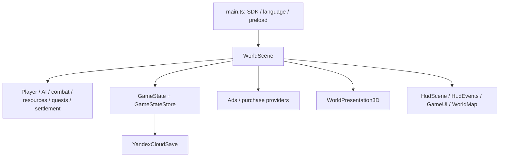

# Architecture

## Runtime and state ownership

`src/main.ts` selects language, initializes SDK/preloads baked surfaces and creates
Phaser. `src/game/config.ts` registers scenes. `src/scenes/BootScene.ts` loads
legacy painted assets only for compatibility rendering and starts WorldScene.
`src/scenes/WorldScene.ts` orchestrates systems, mutations, rewards, providers and
saves. `src/scenes/HudScene.ts` bridges HUD events to DOM GameUI.

Phaser positions/colliders and gameplay data are authoritative. Three.js mirrors
them and terrain heights; it never decides hits/rewards. WebGL2 probing and
compatibility fallback live in `src/game/render3d/RenderingSupport.ts` and the
presentation setup. 3D hides the Phaser world camera; DEV renderer overrides
do not govern production. World and portraits share creature creation/catalogs.
Baked surfaces avoid dense sculpt construction at ordinary startup. Teardown
must release renderer resources and UI/event listeners.

Repeated procedural creatures borrow a reference-counted authored template in
`CreatureModels.ts`/`CreatureInstances.ts`: geometry and bind data are reusable,
while every instance has its own bones, animation clock, mutable costume/face/aura
materials and disposal. Removing one actor must not release another actor's
geometry or change its pose. The final instance releases owned template batches;
global baked surfaces remain shared. Legacy asynchronous asset routes are retained.
`StaticTransforms.ts` caches only rigid final world transforms. Actors, changing
labels and lights remain dynamic; rebuilt scenery is cached after placement.
Terrain chunk membership changes on cell transitions, while conservative camera
visibility is evaluated each presented frame, retaining nearby shadow casters.
`SceneryChunkCache.ts` retains up to 121 recently used chunks after an update,
with the unchanged 7×7 active neighborhood. Inactive cached chunks cannot draw
or cast shadows; eviction and scene teardown release owned geometry/instance
buffers exactly once. Shared nature surfaces/materials survive eviction.
Resource label viewport measurements are shared from resize rather than read
after each label writes DOM styles. Density changes refresh labels even if CSS
dimensions stay unchanged. Icon size and native-DPR text remain unchanged.

`HeroOcclusion3D` preserves the hidden-hero stencil effect with two instanced
passes per shared rigid geometry. Each instance follows the current visible
hero part's world transform, including equipment/outfit changes and cape geometry
updates; reflected transforms retain individual meshes. Overlay instance buffers
are owned, while source hero geometry is borrowed and must never be disposed by
the overlay. Skins/transparent parts retain the existing eligibility rules.
The overlay follows the hero's coordinate frame to retain depth precision far
from the world origin; its visible-pixel mask allows a four-unit depth-buffer
rounding margin before the hidden fill, without moving the source geometry.

Rigid settlement/building transforms are cached after placement or a level/stage
rebuild; camp flame/ring/light animation and labels remain live. Building label
scale uses the same viewport formula, updated on resize or model replacement
instead of traversing the settlement every frame. Deposit-label state and text
localization remain dynamic.
Building replacement/teardown explicitly releases owned roof instance buffers
once through `InstanceResources.ts`; their shared source geometry/materials
remain available to other buildings/actors.

## Data and module boundaries

`SettlementLayout.ts` shares base coordinates/ground dimensions between
settlement systems, models, resource clearance, physics and enemy navigation.
`CreatureScale.ts` contains visual species profiles; it does not own combat stats.
`GoblinSkin.ts` binds shared goblin/humanoid surfaces to eight bones carried by
the existing motion anchors; it owns authored skeleton/material setup and
skeleton cleanup. CreatureModels/CreatureInstances own template and cloned-instance
lifetimes respectively. This local
render route does not introduce a body-physics simulator or move Phaser actors.
`MammalForms.ts` keeps new mammal art profiles separate from the skin binding
algorithm in `MammalSkin.ts`. That module reuses existing jaw/head/leg/tail
motion anchors and owns authored bones, skeleton/material and cleanup;
shared baked geometry/weights remain reusable. It does not own combat physics.
`HumanoidForms.ts` and `ReptileForms.ts` likewise own authored art proportions,
not gameplay stats. `ReptileSkin.ts`, `BirdSkin.ts` and `SmallCreatureSkin.ts`
bind their respective connected surfaces to the existing head/jaw/limb/segment
anchors. Each binder establishes skeleton/material data; the factory coordinates
template/instance cleanup, preserving shared baked geometry and weights. Closed wings,
weapons, horns, fangs and boss identity ornaments retain their attachment frames.
`SurfaceFace.ts` owns cloned materials for fitted face pigment, replacing any
previous owned material. The projection frame is captured before articulation;
face uniforms share one shader program, avoiding species-dependent cache aliases.
It never creates independent white/pupil meshes. `CreatureSculpt.ts` owns baked
surface authoring/bounds; bake and sanity checks hash all contributing art-profile
modules so stale generated assets cannot silently satisfy the gate.
`HeroArmorForms.ts` owns shared closed armor geometry and its material groups;
HeroModel/HeroSkinModel own instance palette materials. Shared plates are not
disposed with an actor. Hero ankle support is render kinematics inside the
production pose, not a new movement/terrain authority. DEV-only
`src/game/qa/HeroPreviewPose.ts` samples that production clock in bounded steps,
so the motion preview does not introduce an independent hero rig or timing rule.

- `src/game/state/GameState.ts`: schema/defaults. WorldScene snapshots progress;
  current actor HP/AI are transient, not independent durable stores.
- `src/game/world/ReleaseRegionMap.ts`, `src/game/world/ReleaseWorldContent.ts`,
  `src/game/bosses/BossArenas.ts`: authoritative layout/content.
- Combat/region profiles, progression balance, gathering/economy, settlement and
  premium config own tuning. UI must derive values rather than duplicate formulas.
- `src/game/ui/HudEvents.ts` connects UI requests and scene actions;
  `src/game/ui/ReconcileDOM.ts` preserves interactive nodes across HUD updates.
- `src/platform/ads/AdsProvider.ts`, `src/platform/purchases/PurchaseProvider.ts`:
  async abstraction; mocks only in DEV.
- `src/platform/yandex/YandexPlatform.ts`: SDK identity/device/language/lifecycle;
  `src/platform/yandex/YandexCloudSave.ts`: cloud ordering and synchronization.
- `src/game/audio/GameAudio.ts`: procedural Web Audio cues/music, gesture unlock,
  mute/pause. `src/game/analytics/Analytics.ts`: DOM events, no external collector.

### Content must remain editable as data

For future content work, keep reusable algorithms separate from authored records
and tuning. Typed TypeScript tables are data in this project; JSON, an editor or
a new runtime loader is not required. Extend the owning table/configuration
before adding another species/region-specific branch to a shared system.

| Concern | Existing owner / boundary |
| --- | --- |
| Reusable behavior | CombatSystem, EnemySystem, navigation, gathering and progression systems consume definitions; presentation cannot decide damage/rewards |
| Content identities/configuration | `src/game/world/ReleaseWorldContent.ts`, `src/game/combat/WeaponDefinitions.ts`, quest/skin/premium configs; stable IDs join gameplay, saves and views |
| World/level data | ReleaseRegionMap, RegionPaths, BossArenas, WorldWatercourses and geography anchors; renderer consumes the same logical layout |
| Balance | RegionBalance/StageCombatProfile, PlayerLevelBalance/UpgradeBalance, HarvestBalance/RegionEconomy and settlement/premium configs; no duplicate UI or art formulas |
| Asset metadata | CreatureCatalog, CreatureAssets/NatureAssets, sculpt manifest and pack SOURCE/LICENSE records; scale/rig/material metadata belongs beside the asset mapping |

Do not put independent copies of authoritative coordinates, stats, costs or IDs
inside UI, preview scenes or rendering code. Harness overrides must be explicit
fixtures, never another production source of truth. New configurable content
should be enumerable/validatable, with defaults and compatibility for saved IDs.

Existing exceptions: BossSystem combines definition construction and behavior;
QuestDirector and CityBuilderSystem contain content/tuning alongside logic;
RegionGeography embeds authored coefficients in relief functions; creature/scenery
builders contain procedural art parameters and per-identity geometry. Those are
current boundaries, not evidence of an external data editor. Isolate new reusable
records when touching these areas, but do not perform a broad extraction/refactor
solely to satisfy this invariant. Keep procedural generation algorithms in code;
their input profiles/anchors should be distinguishable from the algorithms.

## Prototype-first implementation workflow

For a new mechanic, enemy, boss, interaction or complex content feature, normally
validate the functional contract with simple/provisional presentation first:
behavior → automated/debug validation → production presentation → integration QA.
Use the real logical hit/interaction areas and relevant state/reward/save rules
in the prototype; temporary art is not a reason to defer correctness checks.
Use the [existing harnesses](QA_RELEASE.md#verification-harnesses-and-evidence)
when the normal campaign flow makes verification difficult.

Mark provisional presentation in the task plan/owning feature and record which
production presentation and integration criteria remain. A functioning prototype
is not final release content. Art-only work on an already validated mechanic
starts from that existing contract; it does not require replacing finished art
with placeholders or rebuilding the behavior.

## Time, input and persistence

Gameplay uses delta; wall-clock timestamps govern saved cooldowns, production
and premium expiry. Timing scripts exercise the real Phaser clock in fixtures,
not hardware FPS. `src/game/input/PlayerInput.ts` unifies desktop/touch. Rendering
must not multiply movement speed. Pause reasons (visibility/focus/platform/ad)
are tracked independently; ordinary panels/full map intentionally pause, while
post-chest bonus offers are nonmodal. [PERSISTENCE](PERSISTENCE.md) defines which
mutations are saved, how migrations behave and who may overwrite cloud.

## Build/release and debt

`package.json`: Node ≥20.19, ESM. `tsconfig.json`: strict, includes src.
`vite.config.ts`: relative base, normal game entry. Root QA HTML/pages are DEV
tools, not production entries. `scripts/package-release.mjs` packages dist and
manifest; it does not deploy. [QA_RELEASE](QA_RELEASE.md) owns gates.

WorldScene/GameUI are large coordinators, not an ECS or server architecture.
Client state/time are trusted; no receipt-verifying backend exists. Random spawn
building runs during EnemySystem import and can throw. A nested `ruinstead`
gitlink lies outside the root build; its purpose is Unverified. These findings
do not authorize an unrelated rewrite.

Validation: typecheck/build for structure, gameplay/regressions for behavior,
release fixtures for SDK/save boundaries, art checks for representation; manual
device/lifecycle checks remain necessary.
